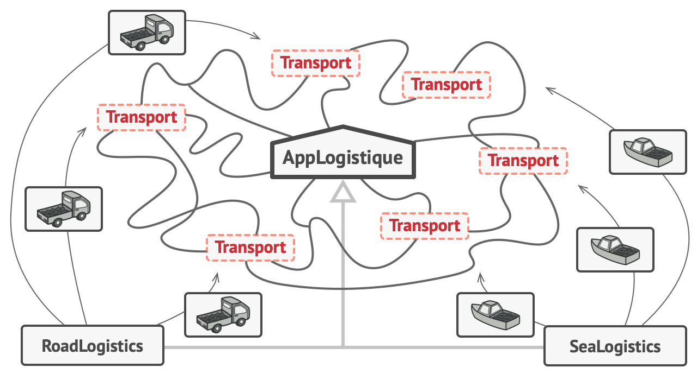
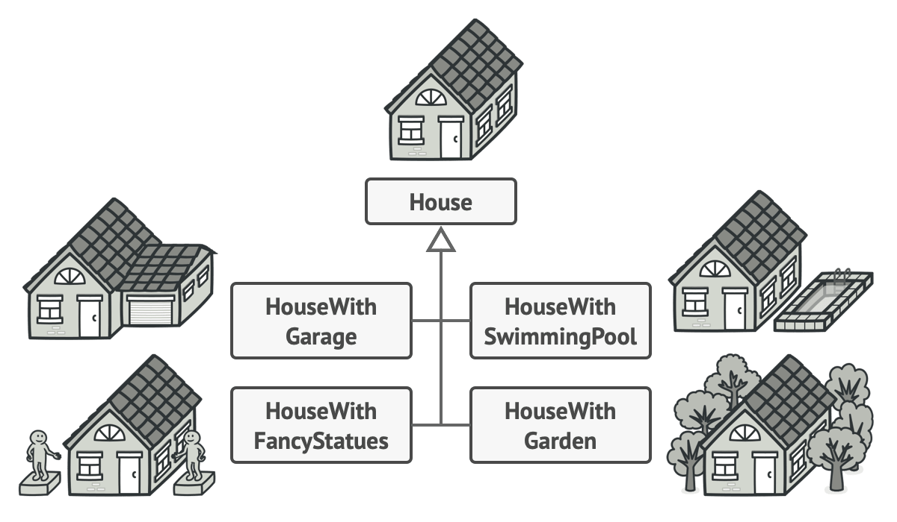
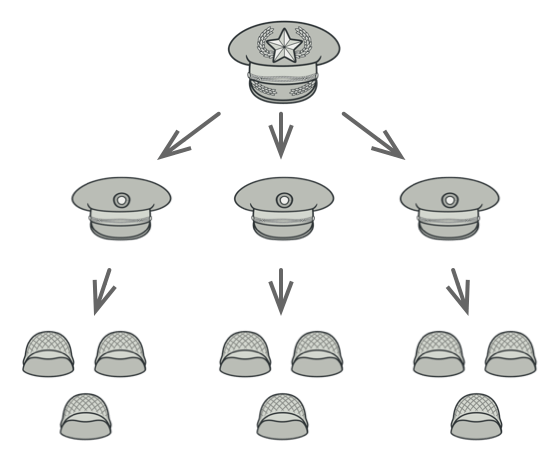

<!-- _class: lead -->
<!-- _paginate: false -->

## Programmation Orientée Objet PHP

---

## Qu'est-ce-que la POO ?

</br>

- La programmation orientée objet est un paradigme de programmation qui consiste à modéliser un système comme un ensemble d'objets, où chaque objet représente un aspect donné du système
- Les objets contiennent des fonctions (ou méthodes) et des données
- Un objet fournit une interface publique pour le reste du code qui voudrait l'utiliser, mais maintient son propre état interne

---

## Principes de la POO

- La programmation orientée objet est basée sur les principes suivant:
  - Encapsulation
  - Abstraction
  - Héritage
  - Polymorphisme

---

## Classe

- Une classe en PHP est une structure qui définit les propriétés et les méthodes communes à un ensemble d'objets
- Une classe est comme un modèle ou un plan qui permet de créer des objets ayant les mêmes caractéristiques et comportements

```php
class Chien {
    // Propriétés de la classe
    // Constructeur
    // Méthodes
}
```

---

## Objet

- Une instance de classe (ou objet) en PHP est une représentation particulière d'une classe
- Pour créer un objet à partir d'une classe, on utilise le mot-clé `new` suivi du nom de la classe

```php
$rex = new Chien();
```

- Dans ce cas on a instancié la classe Chien et obtenu une instance de cette classe

---

## Propriétés

- Les variables au sein d'une classe sont appelées **propriétés** (membre, champ)
- Elles sont définies en utilisant au moins un **modificateur** (public, private, static, readonly, ...) ainsi qu'un **type**
- La déclaration d'une propriété peut comprendre une valeur initiale
- Pour accéder à la **propriété d'une instance** il faut utiliser la syntaxe: `$obj->prop`
- Pour accéder à une **propriété statique** la syntaxe est: `Class::prop`

---

## La pseudo-variable $this

- La pseudo-variable `$this` est disponible au sein de n'importe quelle méthode
- Lorsque qu'une méthode est appelée au sein d'un objet, `$this` est la valeur de l'objet appelant

```php
class Chien {
    private string $nom;

    public function __construct($nom) {
        $this->nom = $nom; // $this permet d'assigner le nom à l'instance
    }
}
```

---

## Le constructeur

- Le constructeur est une méthode spéciale qui est appelée automatiquement lors de la création d'un objet d'une classe
- Le constructeur permet d'initialiser les propriétés de l'objet avec des valeurs données en paramètres ou par défaut
- `public function __construct(...$params): void`

---

## Promotion du constructeur

- PHP permet d'utiliser les paramètres du constructeur pour créer des propriétés de l'objet

```php
class Point {
    public function __construct(protected int $x, protected int $y = 0) {
    }
}
```

- Lorsqu'un argument du constructeur inclus un modificateur de visibilité, PHP l’interprétera comme une propriété d'objet

---

## Destructeur

- Le destructeur est une méthode spéciale qui est appelée automatiquement lorsque l'objet d'une classe est détruit
- Il permet de libérer les ressources utilisées par l'objet, comme la mémoire ou les fichiers ouverts
- `public function __destruct(...$params): void`

---

## Visibilité

- La visibilité d'une propriété, d'une méthode ou d'une constante peut être définie en préfixant sa déclaration avec un mot-clé :
  - **public**: accessible partout
  - **protected**: accessible dans la classe et les classes dérivées
  - **private**: accessible uniquement dans la classe

---

## Statique

- Une propriété ou une méthode statique appartient à la classe dans laquelle elle a été définie, et non à une instance de cette classe
- On accède à un élément statique avec l'opérateur de résolution de portée `::` (Paamayim Nekudotayim)
- Une propriété statique partage la même valeur pour toutes les instances de la classe

```php
public static $nombreInstance = 0;
public static function direBonjour() { /* code */ }
echo Classe::nombreInstance
```

---

<!-- _class: lead -->
<!-- _paginate: false -->

## Héritage

---

## Qu'est-ce que l'héritage ?

- L'héritage en PHP est un mécanisme qui permet à une classe de définir des propriétés et des méthodes communes à un ensemble de classes dérivées
- Une classe qui hérite d'une autre classe est appelée une sous-classe ou une classe enfant
- Une classe qui est héritée par d'autres classes est appelée classe parent ou super classe
- Pour déclarer qu'une classe hérite d'une autre classe, on utilise le mot-clé `extends` suivi du nom de la classe parente

---

## Exemple d'application de l'héritage

- Dans cet exemple, la classe Chien hérite de la classe Animal et peut accéder à sa propriété nom et à son constructeur
- La classe Chien redéfinit également la méthode parler (surcharge)

<div class="columns">

<div>

```php
class Animal {
    public $nom;
    public function __construct($nom) {
        $this->nom = $nom;
    }
    public function parler() {
        echo "je suis un animal";
    }
}
```

</div>

<div>

```php
class Chien extends Animal {
    public function parler() {
        echo $this->nom;
    }
}
```

</div>

<div>

---

## Parent et Self

- Lors de la surcharge d'une méthode, il est possible d’appeler la méthode d'origine à l'aide du mot clé `parent`

```php
    protected function sayHello() {
        parent::sayHello();
        echo 'coucou';
  }
```

- `self` fait référence à la classe à l'intérieur de celle-ci, son fonctionnement est similaire à `$this`

```php
echo self::$maVariableStatique;
```

---

## Empêcher l'héritage et la surcharge

- Le mot-clé `final` empêche les classes enfants de redéfinir une méthode ou constante en préfixant la définition avec final
- Si la classe elle-même est définie comme finale, elle ne pourra pas être étendue

```php
final class BaseClass {
   public function test() {
       echo "BaseClass::test() appelée\n";
   }
}
```

---

## Classe abstraite

- Les classes abstraites ne peuvent pas être instanciées directement, elles servent de modèles pour les classes dérivées
- Les classes abstraites sont déclarées avec le mot-clé `abstract` et peuvent contenir des méthodes abstraites et des méthodes normales
- Une méthode abstraite est une méthode qui n'a pas de corps, mais seulement une signature

---

## Exemple d'application de l'abstraction

- Dans cet exemple Animal est définit avec une méthode abstraite et une méthode normale
- Dans la classe Chien la méthode seDéplacer() doit être redéfinie

<div class="columns">

<div>

```php
abstract class Animal {
    // méthode abstraite
    abstract public function seDeplacer();

    // méthode normale
    public function manger() {
        echo "Je mange";
    }
}

```

</div>

<div>

```php
class Chien extends Animal {
    // définition de la méthode abstraite
    public function seDeplacer() {
        echo "Je cours";
    }
}
```

</div>

<div>

---

<!-- _class: lead -->
<!-- _paginate: false -->

## Interfaces

---

## Qu'est-ce qu'une interface ?

- Les interfaces permettent de définir un **contrat** entre une classe et son utilisation
- Une interface spécifie quelles **méthodes** une classe doit **implémenter**, sans définir comment ces méthodes fonctionnent
- Toutes les méthodes déclarées dans une interface doivent être **publiques**

---

## Composition et héritage

- La composition consiste à inclure une instance d'une classe comme attribut d'une autre classe
- La différence entre l'héritage et la composition est que les classes et les objets dans un code d'héritage sont étroitement couplés, ce qui signifie qu'ils ne doivent pas être modifiés parce qu'en changeant le parent, on risque de modifier l'enfant, et donc de casser le code
- En général, il est recommandé de préférer la composition à l'héritage dans les cas où cela est possible

---

## Implémenter une interface

```php
interface EtreVivant {
    public function manger(): void;
    public function dormir(): void;
}
```

```php
class Humain implements EtreVivant {
    public function manger(): void {
        echo "je mange\n";
    }

    public function dormir(): void {
        echo "ZzZzzZz\n";
    }
}
```

---

<!-- _class: lead -->
<!-- _paginate: false -->

## Les traits

---

## Qu'est-ce qu'un trait ?

- Un trait est un mécanisme de réutilisation de code
- Il permet de **réutiliser** un ensemble de méthodes dans plusieurs classes **indépendantes**
- La sémantique entre les classes et les traits **réduit la complexité** et évite les problèmes typiques de l'héritage multiple et des mixins
- La meilleure façon de comprendre ce que sont les traits et comment les utiliser est de les considérer pour ce qu'ils sont essentiellement : du copier-coller assisté par le langage

---

## Détail sur les traits

- Un trait est semblable à une classe, mais il ne sert qu'à grouper des fonctionnalités d'une manière intéressante
- Il n'est pas possible d'instancier un Trait en lui-même
- C'est un ajout à l'héritage traditionnel, qui autorise la composition horizontale de comportements, c'est à dire l'utilisation de méthodes de classe sans besoin d'héritage

---

## Exemple d'utilisation de trait

```php
trait Hello {
  public string $name;

  public function sayHello() {
    echo "Hello, " . $this->name . "!\n";
  }
}
```

```php
class Person {
  use Hello;
  public function __construct($name) {
    $this->name = $name;
  }
}
```

---

<!-- _class: lead -->
<!-- _paginate: false -->

## Méthodes magiques

---

## Qu'est-ce que les méthodes magiques ?

- Les méthodes magiques sont des méthodes spéciales qui écrasent l'action par défaut de PHP quand certaines actions sont réalisées sur un objet
- Toutes les méthodes commençant par **\_\_** sont réservées par PHP
- Les méthodes **construct et **destruct sont des méthodes magiques

---

## La méthode \_\_toString()

- La méthode `__toString()` détermine comment l'objet doit réagir lorsqu'il est traité comme une chaîne de caractères
- Par exemple, ce que `echo $obj;` affichera

```php
public function __toString()
{
    return 'Mon objet';
}
```

---

## La méthode \_\_invoke()

- La méthode `__invoke()` est appelée lorsqu'un script tente d'appeler un objet comme une fonction

```php
class CallableClass
{
    public function __invoke(int $x)
    {
        var_dump($x);
    }
}
$obj = new CallableClass;
$obj(5);
```

---

## \_\_debugInfo()

<div class="columns">

<div>

- Cette méthode est appelée par `var_dump()` lors du traitement d'un objet pour récupérer les propriétés qui doivent être affichées
- Si la méthode n'est pas définie dans un objet, alors toutes les propriétés publiques, protégées et privées seront affichées

</div>

<div>

```php
class C {
    private $prop;

    public function __construct($val) {
        $this->prop = $val;
    }

    public function __debugInfo() {
        return [
            'propSquared' => $this->prop ** 2,
        ];
    }
}

var_dump(new C(42));
```

</div>

</div>

---

<!-- _class: lead -->
<!-- _paginate: false -->

## Les exceptions

---

## Définition d'une exception

- Une exception est un événement qui se produit lors de l'exécution d'un programme et qui **interrompt** le flux normal des instructions
- En PHP, une exception est un objet de la classe **Exception** ou d'une classe dérivée
- Lorsqu'une exception est lancée, le code qui suit l'instruction `throw` n'est pas exécuté, et PHP cherche le premier bloc `catch` qui peut gérer l'exception
- Si aucun bloc catch n'est trouvé, alors PHP affiche un **message d'erreur fatal** et termine le script

---

## Utilisation des exceptions

- Une exception est lancée avec l'instruction `throw`
- Le code exécuté est généralement entouré d'un bloc `try`
- Chaque `try` doit avec un bloc `catch` ou `finally`
- Plusieurs blocs `catch` peuvent être utilisés pour attraper différentes classes d'exceptions
- Si une exception n'est pas attrapée, une erreur fatale issue de PHP sera envoyée avec un message _"Uncaught Exception ..."_

---

## Lancer une exception

- Utilisation du mot clé `throw` pour lancer une exception

```php
function verifierNombre($nombre) {
  if ($nombre > 1) {
    // Lancer une exception si le nombre est supérieur à 1
    throw new Exception("Le nombre doit être inférieur ou égal à 1");
  }
  return true;
}
```

---

## Capturer une Exception

- Gestion d'une exception dans un bloc Try Catch

```php
try {
    1 / 0;
} catch (Exception $e) {
    echo 'Exception reçue : ',  $e->getMessage(), "\n";
} finally {
    echo "Première fin.\n";
}
```

---

## Création d'une Exception

```php
class FileNotFoundException extends Exception {
  private $filename;

  public function __construct($filename) {
    $this->filename = $filename;
    parent::__construct("Le fichier $filename n'existe pas");
  }

  public function getFilename() {
    return $this->filename;
  }
}
```

---

<!-- _class: lead -->
<!-- _paginate: false -->

## Les namespaces

---

## Définition d'un espace de nom

- Les namespaces sont des moyens de regrouper des classes, des interfaces, des fonctions et des constantes qui ont un rapport logique entre eux
- Ils permettent d'éviter les conflits de noms entre les différents éléments du code et de faciliter l'organisation et la maintenance du code
- Un namespace est déclaré avec le mot-clé `namespace` suivi du nom du namespace

---

## Intérêt des namespaces

Les espaces de noms sont conçus pour résoudre deux problèmes :

1. **Collisions de noms** entre le code que vous créez, les classes, fonctions ou constantes internes de PHP, ou celle de bibliothèques tierces
2. La capacité de faire des **alias** ou de **raccourcir** des _Noms_Extremement_Long_ pour aider à la résolution du premier problème et améliorer la lisibilité du code

---

<style scoped>
    ol {margin: 0;}
</style>

## Utilisation des espaces de nom

Il existe 3 manières pour faire référence à un élément via son namespace

1. Un nom sans qualificatif

```php
 $a = new foo();
```

2. Un nom qualifié ou préfixé

```php
$a = new sousespacedenoms\foo();
```

3. Un nom absolu ou préfixé avec un opérateur global

```php
 $a = new \espacedenomscourant\foo();
```

---

## Importation et alias

- PHP permet d'importer des constantes, classes, interfaces traits et énumérations depuis un namespace

```php
namespace App\Controller;

use Symfony\Bundle\FrameworkBundle\Controller\AbstractController;

class ConceptController extends AbstractController
```

- Il est également possible de donner à un alias à l'aide du mot clé `as`

```php
namespace foo;
use My\Full\Classname as Another;
```

---


<!-- _class: lead -->
<!-- _paginate: false -->

## Principes de conception

---

 ## Principes de conception 


<br/>

<div style="font-size:30px">

**Definition**

</div>

<br>

<div style="font-size:30px">

- Les principes de conception sont des lignes directrices qui aident à structurer et organiser le code de manière à rendre les logiciels plus compréhensibles, maintenables, évolutifs et robustes. 
- Ils fournissent un cadre pour prendre des décisions éclairées en matière de conception logicielle et permettent d'éviter les pièges courants qui peuvent rendre le code difficile à modifier ou à étendre.

</div>

---

 ## Principes de conception 

<br/>

<div style="font-size:30px">

**Objectifs des principes de conception**

</div>

<br>

<div style="font-size:27px">

- **Modularité :** Séparer les fonctionnalités pour qu'elles soient indépendantes et réutilisables.
- **Cohérence :** Assurer que le code soit facile à comprendre pour les autres développeurs.
- **Maintenance :** Faciliter les modifications futures du code sans risques de casser des fonctionnalités existantes.
- **Extensibilité :** Permettre d’ajouter de nouvelles fonctionnalités sans devoir modifier de manière significative le code existant.


</div>

---
 ## Principes de conception 

<br/>

<div style="font-size:30px">

**Exemples de principes de conception courants**

</div>

<br>

<div style="font-size:19px">

- **SOLID :** Ensemble de cinq principes pour la programmation orientée objet (SRP, OCP, LSP, ISP, DIP).
- **DRY (Don't Repeat Yourself) :** Chaque morceau de connaissance doit avoir une seule représentation au sein du système.
- **YAGNI (You Aren't Gonna Need It) :** Ne pas implémenter de fonctionnalités qui ne sont pas immédiatement nécessaires.
- **KISS (Keep It Simple, Stupid) :** Garder les choses simples et éviter la complexité inutile.
- **Separation of Concerns (SoC) :** Séparer les différents aspects d’un programme, chaque aspect étant responsable d’un comportement spécifique.
- **Encapsulation :** Regrouper les données et le comportement d'un objet ensemble tout en cachant les détails internes.
- **Cohésion :** Les éléments d'un module doivent être étroitement liés en termes de fonctionnalité.
- **Couplage faible :** Minimiser les dépendances entre différents modules pour éviter que des changements dans un module nécessitent des modifications dans d’autres.existant.


</div>

---
 ## Principes de conception 

<br/>

<div style="font-size:30px">

**SOLID**

</div>

<br>

<div style="font-size:20px">

**S - Single Responsibility Principle (SRP) :** Un module ou une classe doit avoir une seule responsabilité ou une seule raison de changer. Cela signifie que chaque classe doit se concentrer sur une seule tâche ou fonction.

**O - Open/Closed Principle (OCP) :** Une entité (classe, module, fonction) doit être ouverte à l'extension mais fermée à la modification. Autrement dit, il doit être possible d’ajouter de nouvelles fonctionnalités sans modifier le code existant.

**L - Liskov Substitution Principle (LSP) :** Les objets d’une classe dérivée doivent pouvoir remplacer les objets de la classe mère sans altérer le bon fonctionnement du programme. Cela implique que les classes filles doivent conserver les comportements et les caractéristiques de la classe mère.

**I - Interface Segregation Principle (ISP) :** Les clients ne doivent pas être forcés de dépendre d'interfaces qu'ils n'utilisent pas. Il vaut mieux avoir plusieurs interfaces spécifiques plutôt qu'une seule interface générale.

**D - Dependency Inversion Principle (DIP) :** Les modules de haut niveau ne doivent pas dépendre des modules de bas niveau. Tous deux doivent dépendre d'abstractions. En d’autres termes, il faut dépendre d’abstractions (interfaces ou classes abstraites) plutôt que de classes concrètes.


</div>


--- 

 ## Principes de conception 

<br/>

<div style="font-size:30px">

**DRY**

</div>

<br>

<div style="font-size:30px">

- Le principe **DRY (Don't Repeat Yourself)** est un concept clé en développement logiciel et architecture qui consiste à éviter la duplication inutile de code, de logique métier ou de processus. 
- En d'autres termes, l'idée est de centraliser et de réutiliser les composants, les fonctionnalités ou les concepts afin de réduire la redondance.


</div>

---

 ## Principes de conception 

<br/>

<div style="font-size:30px">

**DRY**

</div>


<div style="font-size:20px">

1. *Modularité*
- **Définition :** DRY encourage la division d'une application en modules réutilisables, où chaque module encapsule une fonctionnalité unique.
- **Exemple :** Dans une architecture de microservices, chaque service est conçu pour être autonome et responsable d'une seule fonctionnalité ou d'un ensemble de fonctionnalités connexes. Cela permet de réutiliser les services sans répéter la même logique dans plusieurs services.
2. *Réutilisation du Code*
- **Définition :** DRY promeut la réutilisation du code pour éviter les répétitions. Cela peut se faire sous la forme de fonctions, bibliothèques ou services communs.
- **Exemple :** Dans une architecture orientée services (SOA) ou microservices, certains services, comme les services d'authentification, de journalisation ou de facturation, peuvent être utilisés par plusieurs autres services, plutôt que de réimplémenter ces fonctionnalités dans chaque service.


</div>

---

 ## Principes de conception 

<br/>

<div style="font-size:30px">

**DRY**

</div>

<div style="font-size:19px">

3. *Centralisation de la Logique Métier*
- **Définition :** La logique métier ou les règles spécifiques à un domaine ne doivent pas être dupliquées dans plusieurs services ou composants. Elle doit être centralisée pour garantir que tout changement ou mise à jour soit reflété dans une seule source de vérité.
- **Exemple :** Utiliser un modèle Domain-Driven Design (DDD) pour isoler la logique métier dans des Bounded Contexts permet de respecter le principe DRY en regroupant la logique d’un domaine dans une seule unité fonctionnelle.

4. *Factorisation des Composants Techniques*
- **Définition :** DRY en architecture concerne aussi la factorisation des composants techniques communs à travers différentes parties d’une application.
- **Exemple :** Dans les architectures n-tiers ou microservices, l'intégration de composants communs comme des services de gestion de la configuration (par exemple, Spring Cloud Config) ou des services de sécurité (comme Keycloak) permet d'éviter de dupliquer ces éléments dans chaque service.


</div>

---

 ## Principes de conception 

<br/>

<div style="font-size:30px">

**DRY**

</div>

<div style="font-size:19px">

5. *Outils de Réutilisation*
- **Définition :** DRY peut être renforcé par l’utilisation d’outils ou de frameworks qui encouragent la réutilisation de composants partagés.
- **Exemple :** Des bibliothèques partagées dans des environnements comme Maven ou Gradle dans des projets Java permettent de centraliser des fonctionnalités transversales (validation de données, gestion des erreurs, etc.) et de les réutiliser à travers plusieurs services ou modules.

6. *Centralisation de la Configuration*
- **Définition :** La configuration d’une application ne doit pas être dupliquée dans plusieurs endroits. DRY encourage l’utilisation de mécanismes pour centraliser la gestion de la configuration.
- **Exemple :** Dans une architecture distribuée, l'utilisation d'un service de configuration centralisé permet de centraliser les paramètres de configuration, plutôt que de les définir manuellement dans chaque service. Cela réduit la répétition et le risque d’erreurs.


</div>

---


 ## Principes de conception 

<br/>

<div style="font-size:30px">

**DRY**

</div>

<div style="font-size:21px">

7. *Eviter la Duplication des Tests*
- **Définition :** DRY peut également s'appliquer aux tests. Plutôt que de dupliquer des scénarios de tests similaires, les tests doivent être factorisés et centralisés autant que possible.
- **Exemple :** En automatisant des tests unitaires et d'intégration réutilisables dans des suites de tests centralisées, vous garantissez que les tests couvrent toutes les parties pertinentes de l’application sans avoir à les répéter dans chaque module ou service.

8. *Gestion des APIs*
- **Définition :** Dans une architecture API, DRY incite à créer des API réutilisables plutôt que d’avoir des points de terminaison qui dupliquent la logique ou les données.
- **Exemple :** Utiliser une API Gateway pour exposer des fonctionnalités communes à plusieurs services et éviter de dupliquer la logique d'accès dans chaque service consommateur.


</div>

---

 ## Principes de conception 

<br/>

<div style="font-size:30px">

**DRY**

</div>

<div style="font-size:21px">

7. *Eviter la Duplication des Tests*
- **Définition :** DRY peut également s'appliquer aux tests. Plutôt que de dupliquer des scénarios de tests similaires, les tests doivent être factorisés et centralisés autant que possible.
- **Exemple :** En automatisant des tests unitaires et d'intégration réutilisables dans des suites de tests centralisées, vous garantissez que les tests couvrent toutes les parties pertinentes de l’application sans avoir à les répéter dans chaque module ou service.

8. *Gestion des APIs*
- **Définition :** Dans une architecture API, DRY incite à créer des API réutilisables plutôt que d’avoir des points de terminaison qui dupliquent la logique ou les données.
- **Exemple :** Utiliser une API Gateway pour exposer des fonctionnalités communes à plusieurs services et éviter de dupliquer la logique d'accès dans chaque service consommateur.


</div>

---

 ## Principes de conception 

<br/>

<div style="font-size:30px">

**Avantages de DRY en architecture**

</div>

<br>

<div style="font-size:29px">

- **Maintenance simplifiée :** En centralisant la logique, les modifications futures sont plus faciles à mettre en œuvre puisqu'il n'est pas nécessaire de modifier plusieurs endroits.
- **Cohérence :** En ayant une seule source de vérité, on évite des comportements incohérents ou des divergences entre différentes parties du système.
- **Réduction du coût :** Moins de redondance signifie moins de code à maintenir, tester et déployer, ce qui réduit les coûts globaux de développement et d’exploitation.


</div>

---

## Principes de conception 

<br/>

<div style="font-size:30px">

**KISS**

</div>

<br>

<div style="font-size:30px">

- Le principe **KISS (Keep It Simple, Stupid)** est une philosophie de conception qui promeut la simplicité et l'efficacité. Il vise à éviter la complexité inutile et à privilégier des solutions simples, claires et faciles à maintenir.
- L'idée est de résoudre les problèmes avec des solutions directes et éprouvées, en évitant la sur-ingénierie.

</div>

---

 ## Principes de conception 

<br/>

<div style="font-size:30px">

**KISS**

</div>


<div style="font-size:20px">

1. *Simplicité dans la conception des systèmes*
- **Définition :** KISS encourage à garder la conception d'un système aussi simple que possible, en évitant d'ajouter des fonctionnalités ou des éléments complexes qui ne sont pas strictement nécessaires.
- **Exemple :** Dans une architecture microservices, éviter de surcharger les services avec des responsabilités multiples. Chaque service doit se concentrer sur une seule tâche et être simple à comprendre et à maintenir.

2. *Modularité*
- **Définition :** La modularité est essentielle pour la simplicité. En divisant un système en modules bien définis et indépendants, il est plus facile de le gérer et de le faire évoluer.
- **Exemple :** Dans une architecture n-tiers, séparer les couches (présentation, application, données) en gardant des responsabilités claires et distinctes permet de simplifier la structure globale du système.


</div>

---

 ## Principes de conception 

<br/>

<div style="font-size:30px">

**KISS**

</div>

<div style="font-size:19px">

3. *Eviter la sur-ingénierie*
- **Définition :** KISS recommande de ne pas créer des solutions trop complexes pour des problèmes simples. La simplicité prime sur des solutions sur-optimisées ou futuristes.
- **Exemple :** Si une base de données relationnelle répond au besoin d'une application, inutile d'introduire une base NoSQL plus complexe sans raisons justifiées.

4. *Utilisation de solutions éprouvées*
- **Définition :** Utiliser des outils, des bibliothèques et des frameworks connus et bien établis aide à maintenir la simplicité et la stabilité.
- **Exemple :** Choisir des frameworks comme Spring Boot ou Laravel, qui sont bien documentés et populaires, permet de maintenir la simplicité et de bénéficier de l’expérience collective de la communauté.

</div>

---

 ## Principes de conception 

<br/>

<div style="font-size:30px">

**KISS**

</div>

<div style="font-size:19px">

5. *Simplicité dans le code*
- **Définition :** Le code doit être clair et facile à lire. KISS encourage l’écriture de code simple, lisible et facilement compréhensible par les autres développeurs.
- **Exemple :** Utiliser des conventions de nommage cohérentes, des méthodes courtes et éviter les optimisations complexes inutiles permettent d’améliorer la lisibilité et la maintenabilité du code.

6. *Facilité de maintenance*
- **Définition :** Un système simple est plus facile à maintenir, car il est plus compréhensible et moins sujet à des erreurs.
- **Exemple :** Une architecture avec des composants bien séparés et une documentation concise est plus facile à maintenir que des systèmes complexes avec des couches multiples et interdépendantes.

</div>

---

 ## Principes de conception 

<br/>

<div style="font-size:30px">

**KISS**

</div>

<div style="font-size:21px">

7. *Réduction des dépendances*
- **Définition :** Limiter les dépendances entre composants permet de réduire la complexité et de maintenir un système simple et flexible.
- **Exemple :** Dans un projet de microservices, éviter de créer des dépendances croisées entre les services permet de garantir que chaque service reste autonome et simple à déployer.

8. *Refus des fonctionnalités inutiles*
- **Définition :** Ne pas ajouter des fonctionnalités complexes ou inutiles au système. Il faut résoudre le problème présent, sans anticiper des cas futurs qui pourraient ne jamais arriver.
- **Exemple :** Dans la conception d’une API, il est préférable de n'exposer que les endpoints nécessaires. Ajouter des fonctionnalités "au cas où" complique le développement et la maintenance.

</div>

---

 ## Principes de conception 

<br/>

<div style="font-size:30px">

**Avantages de KISS en architecture**

</div>

<br>

<div style="font-size:29px">

- **Facilité de développement et d’évolution :** Des systèmes simples sont plus faciles à développer, à tester et à étendre au fur et à mesure que les besoins évoluent.
- **Moins d'erreurs :** Les architectures complexes sont souvent plus sujettes à des erreurs et à des bugs. KISS réduit ce risque en minimisant la complexité.
- **Économie de ressources :** Un système simple utilise souvent moins de ressources (temps de développement, matériel, etc.) et peut être mis en œuvre plus rapidement.

</div>

---

## Principes de conception 

<br/>

<div style="font-size:30px">

**YAGNI**

</div>

<br>

<div style="font-size:30px">

- Le principe **YAGNI (You Aren't Gonna Need It)** est une pratique de développement issue de l'extrême programming (XP) qui consiste à ne pas implémenter des fonctionnalités dont vous n'avez pas immédiatement besoin.
- L'idée est de ne pas développer des fonctionnalités futures "au cas où", mais de se concentrer uniquement sur ce qui est nécessaire à l'instant.

</div>

---

 ## Principes de conception 

<br/>

<div style="font-size:30px">

**YAGNI**

</div>


<div style="font-size:21px">

1. *Eviter l’anticipation de fonctionnalités*
- **Définition :** YAGNI recommande de ne pas coder des fonctionnalités en avance ou par prévision de besoins futurs.
- **Exemple :** Lors de la conception d'une application, ne pas ajouter des options ou des configurations si elles ne sont pas nécessaires dans la version actuelle du projet.

2. *Focalisation sur les besoins actuels*
- **Définition :** Ce principe encourage à se concentrer sur les besoins immédiats du projet, ce qui permet de livrer plus rapidement des fonctionnalités tangibles.
- **Exemple :** Plutôt que de prévoir une architecture qui gère des millions d'utilisateurs futurs dès le début, créer une architecture simple qui répond aux besoins actuels et l'améliorer au fil du temps en fonction de la croissance.

</div>

---

 ## Principes de conception 

<br/>

<div style="font-size:30px">

**YAGNI**

</div>

<div style="font-size:20px">

3. *Réduction de la complexité*
- **Définition :** YAGNI aide à éviter la complexité inutile dans le code, ce qui conduit à des systèmes plus simples et plus maintenables.
- **Exemple :** Ne pas écrire des algorithmes complexes pour gérer des cas limites improbables ou anticipés. Se concentrer sur des scénarios simples et ajouter des fonctionnalités au fur et à mesure qu’elles deviennent nécessaires.

4. *Agilité dans le développement*
- **Définition :** Le principe YAGNI s'aligne avec la méthodologie agile, qui prône des cycles de développement courts, en se concentrant sur la livraison rapide des fonctionnalités les plus prioritaires.
- **Exemple :** Dans un développement agile, les équipes se concentrent sur des incréments de valeur immédiate plutôt que de construire des fonctionnalités complètes qui ne seront utilisées que bien plus tard.

</div>

---

 ## Principes de conception 

<br/>

<div style="font-size:30px">

**YAGNI**

</div>

<div style="font-size:21px">

5. *Eviter la surcharge de fonctionnalités*
- **Définition :** Ne pas ajouter des fonctionnalités supplémentaires qui compliquent inutilement l’application.
- **Exemple :** Dans une API, se limiter aux endpoints nécessaires sans anticiper de futures intégrations. Si des extensions sont nécessaires plus tard, elles pourront être ajoutées sans surcharger l’architecture dès le départ.

6. *Limiter la dette technique*
- **Définition :** En appliquant YAGNI, on réduit la dette technique en n'introduisant pas de code ou de fonctionnalités inutiles qui devront être maintenues ou supprimées plus tard.
- **Exemple :** En ne codant que ce qui est nécessaire à un moment donné, on réduit les risques de devoir refactorer des parties non utilisées ou mal adaptées au contexte actuel.

</div>

---

 ## Principes de conception 

<br/>

<div style="font-size:30px">

**YAGNI**

</div>

<div style="font-size:21px">

7. *Simplification du code*
- **Définition :** En évitant d'anticiper des fonctionnalités ou des cas d'usage futurs, le code reste simple et facile à comprendre.
- **Exemple :** Si une fonctionnalité de recherche avancée n’est pas nécessaire dans un MVP (Minimum Viable Product), il est préférable de créer une simple recherche textuelle et d’ajouter les fonctionnalités avancées ultérieurement si nécessaire.

8. *Amélioration continue*
- **Définition :** YAGNI encourage un développement itératif où l’on ajoute des fonctionnalités au fur et à mesure, basées sur les besoins réels plutôt que supposés.
- **Exemple :** Ajouter des fonctionnalités supplémentaires au produit à la demande, en fonction des retours des utilisateurs, plutôt que d’implémenter des fonctionnalités qui pourraient ne jamais être utilisées.

</div>

---

 ## Principes de conception 

<br/>

<div style="font-size:30px">

**Avantages de YAGNI en architecture**

</div>

<br>

<div style="font-size:29px">

- **Réduction de la complexité :** En évitant les fonctionnalités superflues, l'architecture et le code restent simples et plus faciles à maintenir.
- **Meilleure gestion du temps :** En ne développant que ce qui est nécessaire, le temps de développement est optimisé, permettant de livrer plus rapidement les fonctionnalités critiques.
- **Agilité accrue :** YAGNI permet aux équipes de réagir plus rapidement aux changements de priorités ou aux nouvelles demandes, en minimisant les efforts gaspillés sur des fonctionnalités inutiles.

</div>

---


<!-- _class: lead -->
<!-- _paginate: false -->

## Patrons de conception

---


## Patrons de conception 

<br/>

<div style="font-size:30px">

**Definition**

</div>

<br/>

<div style="font-size:28px">

- Les patterns de conception (ou **design patterns**) sont des solutions récurrentes et éprouvées à des problèmes de conception courants dans le développement logiciel. 
- Ce ne sont pas des morceaux de code prédéfinis, mais plutôt des modèles abstraits qui peuvent être appliqués pour résoudre des problèmes spécifiques dans la conception de logiciels, tout en suivant de bonnes pratiques. 
- Ils offrent des approches structurées pour rendre les systèmes plus maintenables, réutilisables et évolutifs.

</div>


---

## Patrons de conception 

<br/>

<div style="font-size:30px">

**Caractéristiques des patterns de conception**

</div>

<br/>

<div style="font-size:27px">


- **Réutilisabilité :** Les patterns de conception sont génériques et peuvent être réutilisés dans différents contextes et projets.
- **Lisibilité :** Ils permettent de créer du code plus lisible et compréhensible, car ils répondent à des problèmes bien connus.
- **Faible couplage :** Les patterns favorisent des structures logicielles où les composants sont faiblement couplés, facilitant ainsi la maintenance et l'extension du code.

</div>


---


## Patrons de conception 

<br/>

<div style="font-size:30px">

**Classification des patterns de conception**

</div>


<div style="font-size:21px">

1. **Patterns de création :** Ils concernent la manière dont les objets sont créés. Ils cherchent à abstraire ou à contrôler le processus d'instanciation.

  - Exemples : Singleton, Factory, Builder, Prototype.

2. **Patterns structurels :** Ils définissent la manière dont les classes et objets sont structurés pour former des ensembles plus complexes. Ils se concentrent sur la composition des objets et des classes.

  - Exemples : Adapter, Facade, Composite, Proxy.

3. **Patterns comportementaux :** Ils concernent la communication entre les objets et les classes. Ils facilitent les interactions et la gestion du flux de travail.

  - Exemples : Observer, Command, Strategy, State.

</div>


---

## Patrons de conception 

<br/>

<div style="font-size:30px">

**Pourquoi utiliser les patterns de conception ?**

</div>

<br/>

<div style="font-size:27px">

- **Réduction de la complexité :** Les patterns apportent des solutions simplifiées à des problèmes complexes.
- **Maintenabilité :** En adoptant des patterns, il devient plus facile de modifier et d'étendre le système à l'avenir.
- **Meilleure communication :** Les patterns sont largement connus et reconnus, ce qui facilite la compréhension et la collaboration entre les développeurs.
- **Flexibilité et évolutivité :** Ils permettent de concevoir des systèmes qui sont plus flexibles face aux changements de spécifications.

</div>

---
## Patrons de conception 


<div style="font-size:30px">

**Patterns de création : Factory**

</div>

<br/>

<div class="columns"> 

<div>
<center>

</center>

</div>

<div>
<center>

</center>

</div>


</div>

---

## Patrons de conception 


<div style="font-size:30px">

**Patterns de création : Factory**

</div>

<br/>

<div class="columns"> 

<div>
<center>

</center>

</div>

<div>
<center>

</center>

</div>


</div>


---

## Patrons de conception 

<br>

<div style="font-size:30px">

**Patterns de création : Factory**

</div>

<br>

<div style="font-size:27px">

- **Définition :** Le pattern Factory est utilisé pour créer des objets sans exposer la logique de création au client et en renvoyant des instances de classes appropriées.
- **Exemple :** Factory est souvent utilisé dans des frameworks où des objets de différentes sous-classes doivent être créés en fonction de certaines conditions (par exemple, création d'objets en fonction du type de produit).
- **Avantages :** Encapsule la logique de création, permet de respecter le principe d’ouverture/fermeture (OCP).
- **Inconvénients :** Complexité accrue si la hiérarchie de classes devient large.

</div>


---
## Patrons de conception 


<div style="font-size:30px">

**Patterns de création : Singleton**

</div>

<br/>

<div class="columns"> 

<div>
<center>

</center>

</div>

<div>
<center>

</center>

</div>


</div>

---

## Patrons de conception 


<div style="font-size:30px">

**Patterns de création : Singleton**

</div>

<br/>

<div class="columns"> 

<div>
<center>

</center>

</div>

<div>
<center>

</center>

</div>


</div>


---


## Patrons de conception 

<br>

<div style="font-size:30px">

**Patterns de création : Singleton**

</div>

<br>

<div style="font-size:27px">

- **Définition :** Le pattern Singleton garantit qu'une classe n'a qu'une seule instance et fournit un point d'accès global à cette instance.
- **Exemple :** Utilisé pour la gestion des ressources partagées telles que les connexions aux bases de données, les fichiers de configuration ou les instances de services.
- **Avantages :** Centralisation de l’accès à une ressource partagée, réduction de la consommation de ressources.
- **Inconvénients :** Peut entraîner un couplage fort et rendre les tests plus complexes.

</div>

---

## Patrons de conception 


<div style="font-size:30px">

**Patterns de création : Builder**

</div>

<br/>

<div class="columns"> 

<div>
<center>

</center>

</div>

<div>
<center>

</center>

</div>


</div>

---

## Patrons de conception 


<div style="font-size:30px">

**Patterns de création : Builder**

</div>

<br/>

<div class="columns"> 

<div>
<center>

</center>

</div>

<div>
<center>

</center>

</div>


</div>


---

## Patrons de conception 

<br>

<div style="font-size:30px">

**Patterns de création : Builder**

</div>

<br>

<div style="font-size:23px">

- **Définition :** Le pattern **Builder** sépare la construction d'un objet complexe de sa représentation, permettant ainsi de créer différents types d'objets avec la même construction. Il est particulièrement utile pour les objets avec beaucoup de paramètres ou des processus de construction complexes.
- **Exemple :** Utilisé pour créer des objets avec plusieurs options ou étapes, comme la construction d'un objet `House` où vous pouvez spécifier le nombre de chambres, la couleur des murs, le type de toiture, etc.
- **Avantages :** Améliore la lisibilité du code lorsque l'objet a beaucoup d'options, permet une création flexible et une meilleure gestion des objets immuables.
- **Inconvénients :** Peut ajouter de la complexité et nécessite la création d'une classe Builder supplémentaire.

</div>


---


## Patrons de conception 


<div style="font-size:30px">

**Patterns de création : Prototype**

</div>

<br/>

<div class="columns"> 

<div>
<center>

</center>

</div>

<div>
<center>

</center>

</div>


</div>

---

## Patrons de conception 


<div style="font-size:30px">

**Patterns de création : Prototype**

</div>

<br/>

<div class="columns"> 

<div>
<center>

</center>

</div>

<div>
<center>

</center>

</div>


</div>


---

## Patrons de conception 

<br>

<div style="font-size:30px">

**Prototype**

</div>

<br>

<div style="font-size:25px">

- **Définition :** Le pattern **Prototype** est utilisé pour créer de nouveaux objets en copiant (clonant) un prototype existant, plutôt qu'en instanciant une nouvelle classe. Cela permet d'éviter les coûts de création d'un objet "à partir de zéro" et peut être utile lorsque la création d'objets est coûteuse.
- **Exemple :** Utilisé lorsqu'il est nécessaire de créer plusieurs objets similaires mais dont l'initialisation complète est coûteuse, comme dans des systèmes graphiques où des objets complexes doivent être dupliqués (par exemple, des formes ou des graphismes).
- **Avantages :** Permet de créer rapidement des copies d'objets sans devoir passer par des constructeurs lourds. Réduit le couplage entre les classes créatrices et les classes instanciées.
- **Inconvénients :** Peut être compliqué si les objets comportent des références à d'autres objets, surtout si une copie en profondeur (deep copy) est nécessaire.

</div>


---

## Patrons de conception 


<div style="font-size:30px">

**Patterns structurels : Decorator**

</div>

<br/>

<div class="columns"> 

<div>
<center>

</center>

</div>

<div>
<center>

</center>

</div>


</div>


---

## Patrons de conception 


<div style="font-size:30px">

**Patterns structurels : Decorator**

</div>

<div style="font-size:21px">

- **Définition :** Le pattern **Decorator** permet d'ajouter de manière flexible et dynamique des fonctionnalités supplémentaires à un objet, sans modifier sa classe de base. Il consiste à "décorer" un objet en enveloppant celui-ci dans un autre objet qui ajoute des comportements supplémentaires tout en respectant l'interface de l'objet original.
- **Exemple :** Dans une application de commande de boissons, un café peut être décoré avec des ajouts comme du lait ou du sucre, chacun étant un décorateur. Chaque décorateur ajoute une fonctionnalité spécifique sans altérer l'objet café de base.
- **Avantages :** 
  - Flexibilité pour étendre un objet sans modifier son code source.
  - Respect du principe *Open/Closed* (les objets sont ouverts à l'extension, mais fermés à la modification).
  - Compositions simples de comportements supplémentaires.
- **Inconvénients :**
  - Augmentation de la complexité lorsque plusieurs décorateurs sont utilisés.
  - Peut entraîner une multiplication des objets décorés, ce qui peut compliquer la gestion.

</div>

---

## Patrons de conception 

<br>

<div style="font-size:30px">

**Patterns structurels : Composite**

</div>

<br/>

<div class="columns"> 

<div>
<center>

</center>

</div>

<div>
<center>

</center>

</div>


</div>
</div>

---

## Patrons de conception 

<br>

<div style="font-size:30px">

**Patterns structurels : Composite**

</div>

<br>

<div style="font-size:27px">

- **Définition :** Le pattern Composite permet de structurer les objets sous forme d'arbres, où chaque nœud peut être une feuille ou un autre composite.
- **Exemple :** Utilisé pour représenter des hiérarchies comme les systèmes de fichiers (dossiers et fichiers) ou des arbres de composants graphiques.
- **Avantages :** Permet de traiter les objets individuels et composites de la même manière.
- **Inconvénients :** Peut rendre la conception plus complexe si mal utilisé.

</div>

---

## Patrons de conception 

<br>

<div style="font-size:30px">

**Patterns comportementaux : Observer**

</div>

<br>

<div style="font-size:27px">

<br/>

<div class="columns"> 

<div>
<center>

</center>

</div>

<div>
<center>

</center>

</div>


</div>
</div>
</div>

---

## Patrons de conception 

<br>

<div style="font-size:30px">

**Patterns comportementaux : Observer**

</div>

<br>

<div style="font-size:27px">

- **Définition :** Le pattern Observer définit une relation de type un-à-plusieurs entre des objets, de sorte que lorsque l'état d'un objet change, tous ses observateurs en sont informés et mis à jour automatiquement.
- **Exemple :** Utilisé dans des systèmes où plusieurs objets dépendent d'un objet central, comme les interfaces graphiques, les événements UI ou les systèmes de notification.
- **Avantages :** Faible couplage entre les objets, extensibilité facile.
- **Inconvénients :** Peut entraîner une propagation excessive de notifications si mal implémenté.

</div>

---

## Patrons de conception 

<br>

<div style="font-size:30px">

**Patterns comportementaux : Strategy**

</div>

</br>

<div style="font-size:25px">

<br/>

<div class="columns"> 

<div>
<center>

</center>

</div>

<div>
<center>

</center>

</div>


</div>
</div>
</div>

</div>


---

## Patrons de conception 

<br>

<div style="font-size:30px">

**Patterns comportementaux : Strategy**

</div>

<br>

<div style="font-size:24px">

- **Définition :** Le pattern Strategy permet de définir une famille d'algorithmes, de les encapsuler dans des classes séparées, et de les rendre interchangeables à l’exécution, selon le comportement souhaité.
- **Exemple :** Utilisé dans des systèmes où plusieurs approches sont possibles pour accomplir une tâche, comme les calculs de frais de livraison (par poids, par distance, ou forfaitaire) ou les algorithmes de tri (bulle, rapide, fusion).
- **Avantages :** Favorise l'extensibilité et respecte le principe "Ouvert/Fermé" (Open/Closed Principle). Permet de changer facilement d'algorithme sans modifier le contexte.
- **Inconvénients :** Peut complexifier le code en introduisant plusieurs classes pour chaque stratégie, rendant la gestion de ces classes plus difficile.

</div>

---


<!-- _class: lead -->
<!-- _paginate: false -->

## Merci pour votre attention

### Des questions ?
